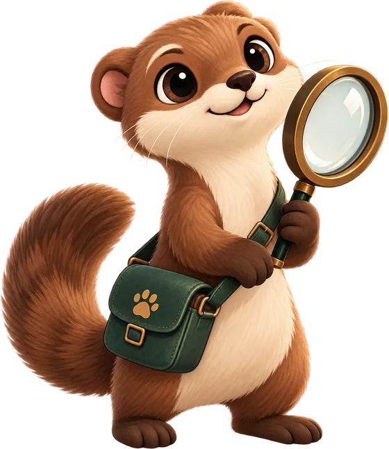
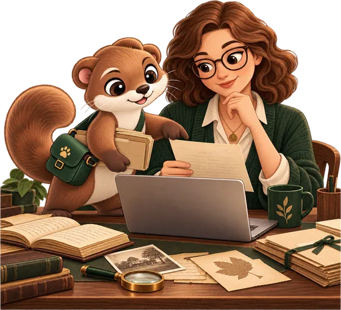

# Nyshporka

  

<em>Reads the manuscript. Brings back what it finds.</em>

**Nyshporka helps you look for your ancestors in archival documents** — parish
registers, confession lists, revision lists of the 18th–19th centuries. But it
does not work like an ordinary program.

## The assistant does the work, you decide

  

An assistant such as Claude or ChatGPT can be allowed to work on your
computer: open folders, run programs, save the results — and ask your
permission every time. An assistant like this is called an **agent**.

Nyshporka is made precisely for it. You write in plain words:
*“here is a folder of scans of the Chechelnyk parish registers — find all the Kovalskyis”*.
The assistant reads the handwritten folios, looks for the surname and brings
back the lines it has found right on the scan, with the folio number.

**Whether this is your family is for you to decide.** In the same way, you decide
what to order from the archive and whether to share what has been read. The
assistant shows; it does not draw conclusions for you.

!!! tip "Watch it live"

    Nyshporka is shown at work in the stream
    [“ШІ-агенти в генеалогії: дослідження майбутнього”](https://www.youtube.com/live/VsvenHgbVZY)
    (“AI agents in genealogy: researching the future”, “В гостях у Качки” No. 11) —
    [the demonstration starts at about minute
    42](https://www.youtube.com/live/VsvenHgbVZY?t=2550).

## What Nyshporka gives the assistant

On its own, the assistant knows nothing about archives and cannot read an old
manuscript. Nyshporka gives it:

* **knowledge of where things are** — archive guides, fond inventories, lists of
  villages and parishes;
* **the ability to read manuscripts** — three reading models trained on
  Ukrainian, Moldovan and Polish archives: **Pysar** and **Diak** read Cyrillic,
  **Skryba** reads Latin script;
* **memory** — what has already been looked through and found, so that the same
  folios are not leafed through twice;
* **rules of honest work** — “not found” always comes with an explanation of how
  many folios were looked through.

## Why this is a different approach

An ordinary program can do exactly what was built into it: as many buttons, as
many possibilities. Nyshporka gives the assistant separate skills — find a
file, read a folio, find a surname, record a discovery — and the assistant
combines them into what your particular question needs: *“make a table of all
the marriages in this village in the 1820s”*, even though nobody ever made a
separate button for that. And the cleverer assistants become, the more
Nyshporka can do — even without an update.

## What you need

* A computer with Windows, macOS or Linux and about 5 GB of free space.
* Nyshporka itself — free and open source.
* An assistant that can work on a computer: **Claude Desktop** (a Claude Pro
  or Max subscription), **Claude Code** or **Codex** (a ChatGPT subscription).

All of this installs in half an hour, without typing a single command —
[**“Install and connect an assistant”**](install.md). The assistant will install
the reading models itself: these are two one-off steps, `nysh htr install` and
`nysh models get`.

**Your scans go nowhere** — everything runs on your computer. There is no
telemetry and no accounts.

!!! warning "Status: early version"

    The catalogues, manuscript reading, surname search, record-keeping and the
    browser app all work. What is still missing is listed in the
    [frequently asked questions](faq.md#chogo-shche-nemaie), with nothing left unsaid.

## Words you will meet here { #slovnyk }

| word | what it is |
|---|---|
| **assistant (agent)** | an AI assistant — Claude Desktop, Claude Code or Codex — that is allowed to work on your computer |
| **reading models** | Pysar, Diak and Skryba — they turn a handwritten folio into text |
| **read text** | what the model has read from a folio. It contains mistakes: you search in it, and look at what you find on the scan |
| **file** | an archival storage unit with a reference code, e.g. `ДАХмО 315-1-8433`; in Nyshporka, one folder of scans |
| **folio · frame** | a page of the file · a single image (scan) |
| **imaging** | the set of scans of one file — your own, bought, or from an archive's website |
| **working folder** | Nyshporka's folder, by default `Документи\Нишпорка` (Documents\Nyshporka): this is where your research lives. In commands it is called the “workspace” |
| **app** | Nyshporka's window in the browser — for seeing what has been found and leafing through the scans and the read text |
| **skills** | ready-made working routines for the assistant: how to read a file, how to search for a surname, where to dig next |
| **Supriaha** | a shared bank of files already read, at [nyshporka.online/supriaha](https://nyshporka.online/supriaha): what one person has read does not need to be read again |

## Where next

* [Install and connect an assistant](install.md)
* [How to work](start.md) — what to ask for, how to check what has been found
* [Frequently asked questions](faq.md)
* For the assistant and developers — [reference guides](agents/index.md)
